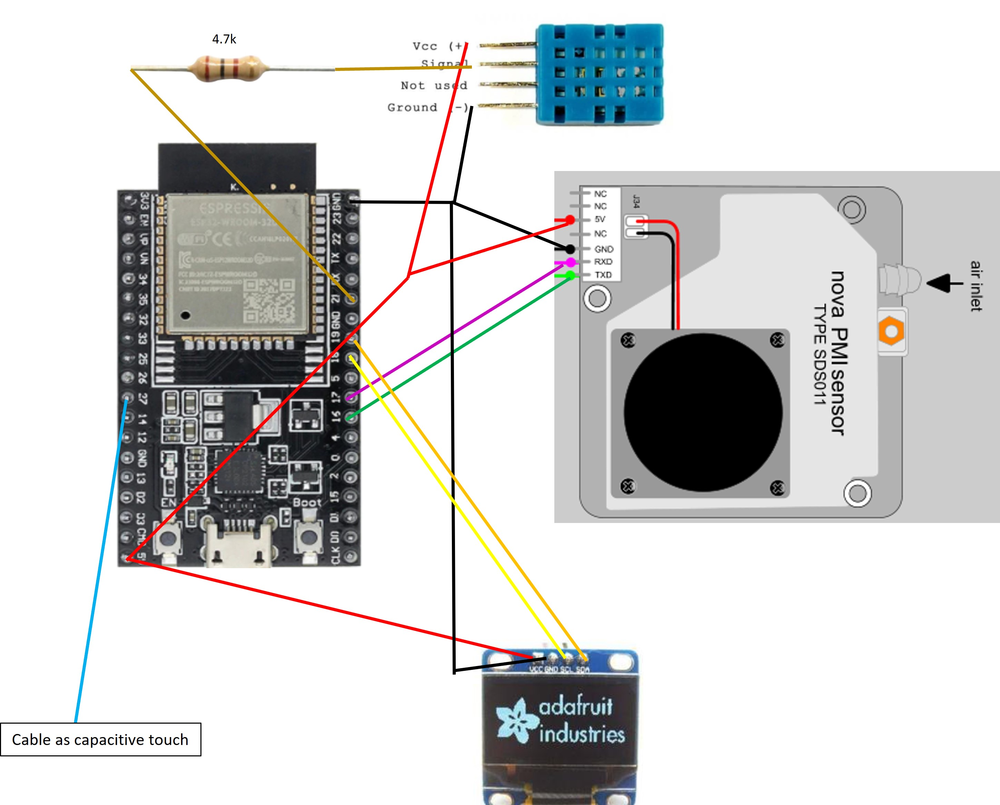

# Air_Quality_Meter
By using a 3D printer in house it is important to understand the health impact like micro particles which are generated in the build process of the 3D printer. The SDS010 is used to measure the air quality.

## Description and operation instructions
The SDS010 monitors the airquality by neasuring the 2.5 and 10 um particles in the air. The SDS010 has a lifetime of 8000 hours, hence the measurement is reduced to periodic measurements. In this case every 10 minutes. The ESP32-WROOM-32D is configured via the ESPHome plugin in Home Assistant. 

 ## Technical description
The SDS010 is connected to the ESP32-WROOM-32D

| SDS101  | ESP32      |
| --------|------------|
| TX      | rx_pin: 16 |
| RX      | tx_pin: 17 |


### Parts
1 x ESP32-WROOM-32D


1 x SDS010


### Schematic overview


### ESPHome installation
See the instructions https://github.com/Wilko01/ESPHome  (not listed here)


### ESPHome Configuration in Home Assistant
Create a new device  with these settings
```
# Defining an SDS011 Air Quality Sensor in ESPHome
esphome:
  name: esp17
  platform: ESP32
  board: esp32doit-devkit-v1

# Enable logging
logger:

# Enable Home Assistant API
api:

ota:
  password: "4764505ce89048d2422149c83dbc51ca"

wifi:
  ssid: !secret wifi_ssid
  password: !secret wifi_password

  # Enable fallback hotspot (captive portal) in case wifi connection fails
  ap:
    ssid: "Esp17 Fallback Hotspot"
    password: "kWzangCTxyzK"

captive_portal:

# Defining the UART
uart:
  rx_pin: 16
  tx_pin: 17
  baud_rate: 9600

sensor:
  - platform: sds011
    pm_2_5:
      name: "Particulates <2.5µm Concentration"
    pm_10_0:
      name: "Particulates <10.0µm Concentration"
    # Set the update interval to balance the accuracy and sensor life
    update_interval: 10min
```

### Interface
#### Home Assistant
Home Assistant is connected via the ESPHome integration.

### Testing
Create a dashboard in Home Assistant and see the measurements come in. Depending on the measurement interval this can take some time.

### Information
- [Rules syntax](https://esphome.io)
- [Air quality sensor with ESPHome](https://cyan-automation.medium.com/creating-an-air-quality-sensor-using-an-sds011-and-esphome-7305f764f6f5)

Generic
- [Markdown Cheat Sheet](https://www.markdownguide.org/cheat-sheet/)


### Problems
..

### Wishlist
..


